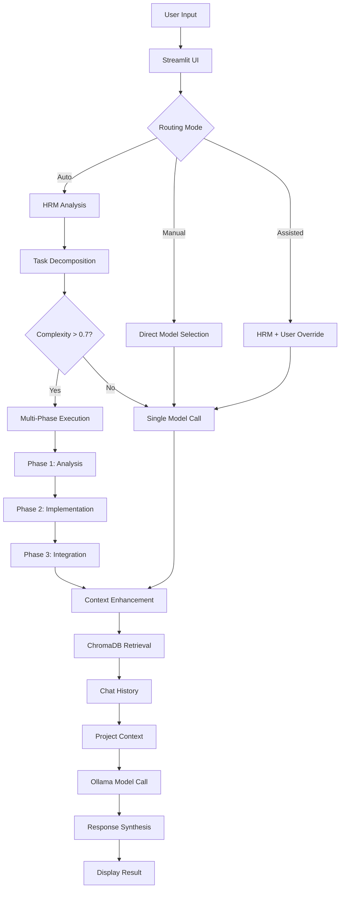

# Multi-Model AI Development Assistant

**An autonomous, locally-running coding assistant specialized for FAUST/JUCE audio DSP development**

[](https://www.python.org/downloads/)
[](https://streamlit.io/)
[](LICENSE)
[-silver)](https://www.apple.com/)

## Overview

A hierarchical multi-agent system featuring intelligent routing and specialized models for audio DSP development. Runs 100% locally on Apple Silicon (optimized for M4 Max) via Streamlit, combining DeepSeek-R1, Qwen2.5-Coder, and Qwen2.5 models with a Hierarchical Reasoning Model (HRM) for complex task decomposition and orchestration.

### Key Features

- **Multi-Model Orchestra**: DeepSeek-R1 (reasoning/debugging) + Qwen2.5-Coder (implementation) + Qwen2.5 (math/physics)
- **HRM Orchestration**: Hierarchical Reasoning Model for task decomposition and intelligent model routing
- **Knowledge Integration**: FAUST/JUCE documentation with ChromaDB vector search
- **Integrated Code Editor**: Syntax highlighting, AI-powered editing with diff view
- **Project Management**: Persistent chat histories and file organization
- **System Monitor**: Real-time status dashboard for Ollama, ChromaDB, HRM, and models
- **MPS Acceleration**: Optimized for Apple Silicon M4 Max

## Requirements

### System Requirements
- **macOS** with Apple Silicon (M4 Max recommended)
- **64GB+ RAM** (128GB recommended for all models)
- **200GB+ free disk space** for models and data
- **Python 3.10+**

### Model Requirements
- **Ollama** installed and running
- Models pulled via Ollama:
  - `deepseek-r1:70b` - Reasoning and debugging
  - `qwen2.5-coder:32b` - Code implementation
  - `qwen2.5:32b` - Math/physics computations
  - `nomic-embed-text` - Embeddings for ChromaDB

### HRM Requirements
- HRM repository cloned to `lib/hrm/`
- PyTorch with MPS support (Apple Silicon) or CUDA 12.6+
- FlashAttention for optimal performance

## Installation

### 1. Clone the Repository
```bash
git clone https://github.com/Mando-369/multi-model-AI-development-assistant.git
cd multi-model-AI-development-assistant
```

### 2. Install Ollama and Models
```bash
# Install Ollama (macOS)
curl -fsSL https://ollama.ai/install.sh | sh

# Start Ollama service
ollama serve

# Pull required models
ollama pull deepseek-r1:70b
ollama pull qwen2.5-coder:32b
ollama pull qwen2.5:32b
ollama pull nomic-embed-text
```

### 3. Install HRM
```bash
cd lib
git clone https://github.com/sapientinc/HRM hrm
cd hrm
pip install -r requirements.txt
cd ../..
```

### 4. Create Virtual Environment
```bash
python -m venv venv
source venv/bin/activate  # On macOS/Linux
```

### 5. Install Dependencies
```bash
pip install -r requirements.txt
```

### 6. Set Up Documentation

```bash
# Download documentation (optional - if not already present)
python scripts/download_faust_docs_complete.py
python scripts/download_juce_docs.py
python scripts/download_python_docs.py

# Load documentation into ChromaDB (required for knowledge base)
python scripts/load_documentation.py
```

#### Documentation Management

The knowledge base uses ChromaDB for persistent storage. Documents are loaded once and persist between app restarts.

```bash
# Check current knowledge base status
python scripts/load_documentation.py --status

# Update only modified files (detects changes via hash)
python scripts/load_documentation.py --update

# Full reset and reload (clears everything)
python scripts/load_documentation.py --reset
```

## Usage

### Starting the System
```bash
# Activate virtual environment
source venv/bin/activate

# Run the Streamlit app
streamlit run main.py

# Access at http://localhost:8501
```

### Routing Modes

1. **🚀 Auto Mode**: Let HRM decide the best model
2. **🎯 Manual Mode**: Select model directly
3. **💡 Assisted Mode**: Get HRM recommendations

### Interface Tabs

The application has 4 main tabs:

| Tab | Description |
|-----|-------------|
| **💬 AI Chat** | Multi-model conversations with project context |
| **📝 Code Editor** | Syntax-highlighted editor with AI assistance |
| **📚 Knowledge Base** | File uploads and documentation management |
| **🖥️ System Monitor** | Real-time status dashboard |

### System Monitor

The System Monitor tab provides real-time visibility into all system components:

- **Ollama Status**: Connection health, response times, available models
- **ChromaDB Status**: Document count, index health
- **HRM Status**: Device detection (MPS/CUDA/CPU), cache status
- **Model Status**: Which models are loaded, lazy loading info
- **Activity Log**: Recent system events with timestamps
- **System Info**: Python, Streamlit, and library versions

Use the **Refresh Status** button to update all metrics.

### Example Queries

**FAUST DSP Development**:
```
"Create a FAUST reverb with pre-delay and damping"
```

**Complex Architecture**:
```
"Design a real-time audio plugin architecture with JUCE"
```

**Code Optimization**:
```
"Optimize this C++ audio buffer processing code"
```

## Project Structure

```
multi-model-AI-development-assistant/
├── main.py                    # Streamlit entry point
├── setup.sh                   # Automated setup script
├── src/                       # Core application logic
│   ├── core/                  # System components
│   │   ├── multi_model_system.py    # Model orchestration
│   │   ├── project_manager.py       # Project management
│   │   ├── file_processor.py        # File processing
│   │   ├── context_enhancer.py      # Context enhancement
│   │   └── prompts.py              # System prompts
│   ├── ui/                    # User interface components
│   │   ├── editor_ui.py            # Code editor interface
│   │   ├── file_browser.py         # File browser
│   │   ├── file_editor.py          # File editing logic
│   │   ├── system_monitor.py       # System status dashboard
│   │   └── ui_components.py        # UI component library
│   └── integrations/          # External integrations
│       ├── hrm_local_wrapper.py    # HRM integration
│       └── hrm_integration.py      # HRM orchestration
├── scripts/                   # Utility scripts
│   ├── download_faust_docs_complete.py  # FAUST docs downloader
│   ├── download_juce_docs.py            # JUCE docs downloader
│   ├── download_python_docs.py          # Python docs downloader
│   └── test_reorganization.py           # Structure validation
├── tests/                     # Test suite
│   ├── test_chromadb_validation.py     # ChromaDB tests
│   ├── test_hrm_integration.py         # HRM integration tests
│   └── populate_test_data.py           # Test data setup
├── lib/hrm/                   # Hierarchical Reasoning Model
├── chroma_db/                 # Vector databases
├── faust_documentation/       # FAUST DSP docs
├── juce_documentation/        # JUCE framework docs
├── projects/                  # User projects
├── .claude/                   # Claude Code agents (dev only)
├── .github/workflows/         # CI/CD pipelines
├── requirements*.txt          # Python dependencies (modular)
└── README.md                  # This file
```

## Architecture

### System Overview

```
┌─────────────────────────────────────────────────────────────────────────────┐
│                           STREAMLIT UI (main.py)                            │
│  ┌─────────────┐  ┌─────────────┐  ┌─────────────┐  ┌─────────────────────┐ │
│  │   Project   │  │    Model    │  │    Chat     │  │    File Editor     │ │
│  │  Management │  │  Selection  │  │  Interface  │  │   (Ace Editor)     │ │
│  └─────────────┘  └─────────────┘  └─────────────┘  └─────────────────────┘ │
└────────────────────────────────┬────────────────────────────────────────────┘
                                 │
                                 ▼
┌─────────────────────────────────────────────────────────────────────────────┐
│                    MultiModelGLMSystem (Orchestrator)                        │
│  ┌─────────────────────────────────────────────────────────────────────────┐│
│  │                    HRM Local Wrapper (MPS Accelerated)                  ││
│  │  ┌──────────────┐  ┌──────────────┐  ┌──────────────────────────────┐  ││
│  │  │ Task Analysis│  │ Complexity   │  │ Domain Pattern Matching      │  ││
│  │  │ & Decompose  │  │ Estimation   │  │ (FAUST/JUCE/Math/General)    │  ││
│  │  └──────────────┘  └──────────────┘  └──────────────────────────────┘  ││
│  └─────────────────────────────────────────────────────────────────────────┘│
│                                    │                                         │
│        ┌───────────────────────────┼───────────────────────────┐            │
│        ▼                           ▼                           ▼            │
│  ┌───────────────┐         ┌───────────────┐         ┌───────────────┐      │
│  │ DeepSeek-R1   │         │ Qwen2.5-Coder │         │   Qwen2.5     │      │
│  │    :70b       │         │     :32b      │         │     :32b      │      │
│  │               │         │               │         │               │      │
│  │  Reasoning    │         │Implementation │         │  Math/Physics │      │
│  │  Debugging    │         │  FAUST/C++    │         │  Calculations │      │
│  │  Architecture │         │  Code Gen     │         │  DSP Theory   │      │
│  └───────────────┘         └───────────────┘         └───────────────┘      │
│        │                           │                           │            │
│        └───────────────────────────┼───────────────────────────┘            │
│                                    ▼                                         │
│  ┌─────────────────────────────────────────────────────────────────────────┐│
│  │                      Context Enhancement Layer                          ││
│  │  ┌──────────────────────────────────────────────────────────────────┐  ││
│  │  │                     ChromaDB Vector Store                         │  ││
│  │  │  ┌────────────┐  ┌────────────┐  ┌────────────┐  ┌────────────┐ │  ││
│  │  │  │   FAUST    │  │    JUCE    │  │   Python   │  │  Uploaded  │ │  ││
│  │  │  │   Docs     │  │    Docs    │  │    Docs    │  │   Files    │ │  ││
│  │  │  │ 758 chunks │  │ 165 chunks │  │ 92 chunks  │  │    ...     │ │  ││
│  │  │  └────────────┘  └────────────┘  └────────────┘  └────────────┘ │  ││
│  │  └──────────────────────────────────────────────────────────────────┘  ││
│  └─────────────────────────────────────────────────────────────────────────┘│
└─────────────────────────────────────────────────────────────────────────────┘
                                 │
                                 ▼
┌─────────────────────────────────────────────────────────────────────────────┐
│                              OLLAMA (Local)                                  │
│                   Model serving on localhost:11434                           │
└─────────────────────────────────────────────────────────────────────────────┘
```

### Data Flow



## Configuration

### Model Settings
Edit `config.yaml`:
```yaml
models:
  deepseek_r1:
    temperature: 0.6
    top_p: 0.95
    max_tokens: 32768
  qwen_coder:
    temperature: 0.7
    top_p: 0.8
    max_tokens: 8192
  qwen_math:
    temperature: 0.6
    top_p: 0.95
    max_tokens: 8192

hrm:
  complexity_threshold: 0.6
  max_subtasks: 10
  enable_mps: true
```

### ChromaDB Settings
```yaml
chromadb:
  embedding_model: "all-MiniLM-L6-v2"
  embedding_dim: 768
  collection_size: 10000
```

## Contributing

We welcome contributions! Please see [CONTRIBUTING.md](CONTRIBUTING.md) for guidelines.

### Development Setup
```bash
# Install development dependencies
pip install -r requirements-dev.txt

# Run tests
pytest tests/

# Run linting
flake8 .
black .
```

## Performance Benchmarks

| Task Type | Model | Avg Response Time | Quality Score |
|-----------|-------|------------------|---------------|
| FAUST/Code | Qwen2.5-Coder:32B | 3.5s | 9.4/10 |
| Reasoning/Debug | DeepSeek-R1:70B | 5.2s | 9.6/10 |
| Math/Physics | Qwen2.5:32B | 2.8s | 9.3/10 |
| Complex Multi-Task | HRM + All | 12.5s | 9.5/10 |

*Benchmarked on M4 Max with 128GB unified memory*

## Troubleshooting

### Common Issues

**Ollama Connection Error**:
```bash
# Ensure Ollama is running
ollama serve

# Check model availability
ollama list
```

**ChromaDB Initialization Error**:
```bash
# Reset database
rm -rf chroma_db/
python scripts/init_chromadb.py
```

**Memory Issues**:
```bash
# Use smaller model variants for limited VRAM
ollama pull deepseek-r1:32b       # Instead of 70b
ollama pull qwen2.5-coder:14b     # Instead of 32b

# Unload unused models
ollama stop deepseek-r1:70b
```

## Documentation

- [User Guide](docs/user_guide.md)
- [API Reference](docs/api_reference.md)
- [Model Documentation](docs/models.md)
- [HRM Implementation](docs/hrm.md)

## Roadmap

- [ ] Extended C++20 documentation support
- [ ] WebAssembly FAUST compilation
- [ ] Real-time collaboration features
- [ ] Custom HRM training pipeline
- [ ] Audio-specific code validation
- [ ] VSCode extension
- [ ] Web-based UI option

## License

This project is licensed under the MIT License - see the [LICENSE](LICENSE) file for details.

## Acknowledgments

- [HRM](https://github.com/sapientinc/HRM) for hierarchical reasoning architecture
- [Ollama](https://ollama.ai/) for local model serving
- [Streamlit](https://streamlit.io/) for the web interface
- [ChromaDB](https://www.trychroma.com/) for vector storage
- [FAUST](https://faust.grame.fr/) and [JUCE](https://juce.com/) communities

## Contact

- **GitHub Issues**: [Report bugs or request features](https://github.com/Mando-369/multi-model-AI-development-assistant/issues)
- **Discussions**: [Join the conversation](https://github.com/Mando-369/multi-model-AI-development-assistant/discussions)

---

Built for the audio DSP community.